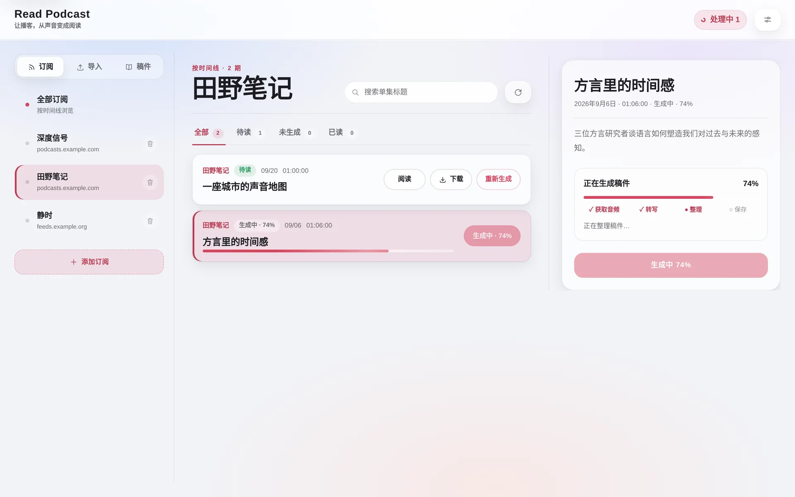
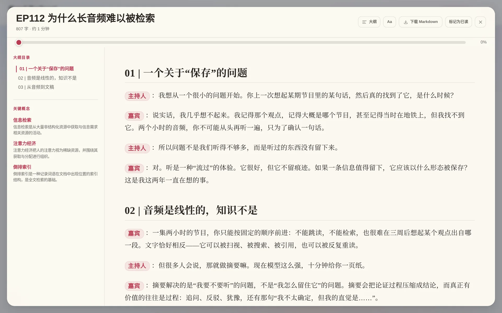
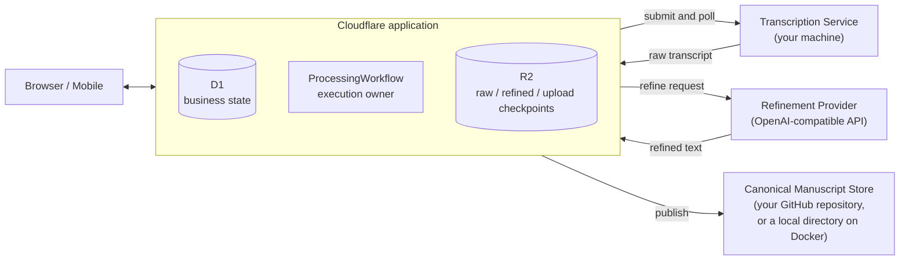

# Read Podcast

**English** · [简体中文](README.zh-CN.md)

> [!NOTE]
> **Runs on the Cloudflare Free plan**: the whole Cloudflare application (Workers, D1, Workflows, R2) fits in the Workers Free tier, so there is no Cloudflare bill. You still need a domain on Cloudflare DNS, a machine to run the Transcription Service (or a cloud transcription provider), and an OpenAI-compatible LLM API for refinement, billed by that provider.
>
> **Relation to v0.x (Python / macOS App)**: Read Podcast was originally created as a native macOS desktop app (v0.x, built with Python, local MLX Whisper, and desktop packaging). Desktop development is currently paused, and the v0.x codebase is archived on the [`legacy/python`](https://github.com/xielevi/read-podcast/tree/legacy/python) branch. Starting with v1.0, Read Podcast has been rewritten as a cloud-native personal reading service (Cloudflare Workers/D1/Workflows/R2 + external transcription compute) with a responsive WebUI for phone, tablet, and desktop reading.

**A personal podcast reading system that runs on the Cloudflare Free plan.** Pick the episodes worth keeping, and Read Podcast turns
each one into a complete, readable long-form manuscript — not a summary — that you can read on
any device, share as a public page, and keep as Markdown in a store you own.

<p align="center">
  
</p>

## Why

Podcasts are one of the best places to hear people think out loud, and one of the worst places
to keep what they said. Audio is linear: you can't skim it, search it or quote it, and three weeks
later you can't find the ten minutes that mattered. The usual fix — an AI summary — answers
"should I listen?", but compresses away the argument itself: the follow-up questions, the
examples, the hesitation.

Read Podcast takes the opposite approach. The output is a **manuscript**: the whole
conversation, with speakers labelled, verbal noise removed and topics given headings — about as
long as the transcript it came from. You read it instead of re-listening, and it stays yours.

## How you use it

**Subscribe → Generate → Read → Share.** The workspace has three areas — *Subscriptions*,
*Import* and *Manuscripts* — plus the reader.

1. **Subscribe or import.** Add a podcast by searching the Apple Podcasts directory or pasting
   an RSS URL. The episode list comes from the feed and refreshes when you browse it. You can
   also import your own audio file (up to 200 MiB) — a talk, a lecture, an interview.
2. **Generate.** Nothing is processed automatically: you choose an episode and click
   *Generate*. Progress is real, reported in four stages — fetching audio, transcribing,
   refining, saving — and you can close the browser meanwhile. Imports let you pick a manuscript
   style (magazine edit, clean verbatim, structured interview) and add your own instructions.
3. **Read.** A focused reader with an outline and typography and theme settings; the owner
   also gets reading progress and read/unread state. **Key concepts** are proposed by the model
   the first time the owner opens a manuscript and kept only if they match a real Chinese
   Wikipedia article, so every concept link points to a real page. Every manuscript can be
   downloaded as Markdown.
4. **Share.** The same workspace is public and read-only at `/`: anyone can browse your
   subscriptions and read published manuscripts. Everything that changes something — subscribing,
   generating, settings, read state — lives under `/manage`, behind Cloudflare Access.

<p align="center">
  
</p>

Every published manuscript is a Markdown file with YAML front matter (title, podcast, date,
duration, source links), stored in the **Canonical Manuscript Store**: your own GitHub
repository on a Cloudflare deployment, or a local directory on the host when running with
Docker (ready for Obsidian or any editor). Read Podcast is the reading
interface in front of it: the database only indexes manuscripts, and the store holds the one durable
copy of each.

> **Language.** Read Podcast currently targets Chinese-language podcasts: the interface, the
> built-in refinement prompts and concept verification (Chinese Wikipedia) are all Chinese.
> Transcription itself auto-detects the language.

## Why it is built this way

Turning a two-hour episode into a manuscript takes tens of minutes of transcription and one
long LLM call. A script that does this in one go works until something fails halfway. Read
Podcast is built so that every expensive step happens once:

- **A durable pipeline, not a script.** Each generation is a Cloudflare Workflow with durable
  checkpoints. The raw transcript is saved to R2 as soon as it exists, so a failed refinement
  retries without transcribing again, and a failed save retries without calling the model
  again. A scheduled job starts queued tasks that have no workflow yet and fails tasks whose
  workflow died, so nothing hangs silently.
- **Bring your own compute.** Transcription runs on a machine you choose — the reference is a
  Mac with Apple Silicon running MLX Whisper locally — behind a small HTTP contract. It holds no
  credentials and no durable business state, and only needs to be online while an episode is being transcribed.
  Refinement uses any OpenAI-compatible API you configure.
- **Edited, not summarized.** The default editor aims for roughly 75–85% of the raw transcript:
  verbal redundancy is compressed while independent information and reasoning stay intact.
  A separate completeness guard rejects output below the configured hard floor (default 70%) or
  without basic manuscript structure. A rejected result is never published; the transcript is
  kept so you can retry.
- **You own the output.** Manuscripts live in a store you control — a GitHub repository (plain
  Markdown, versioned) on Cloudflare, or a local directory on Docker. Public readers are served
  the exact version recorded at publish time,
  cached at Cloudflare's edge, so anonymous traffic does not hit GitHub on every read.
- **Public reading, private control, no accounts.** Access control is Cloudflare Access on two
  path prefixes. The application itself has no users, passwords or sessions.

## Architecture at a glance



Cloudflare owns every task from creation to publication; the other three boxes are replaceable
dependencies it calls. Readers only ever talk to the Cloudflare application.

**Where your data lives**

| What | Where | Kept for |
|---|---|---|
| Subscriptions, episode lists, tasks, read state, settings, the index of published manuscripts | Cloudflare D1 | until you delete it |
| Uploaded audio | Cloudflare R2 `uploads/` | 1 day |
| Raw transcripts | Cloudflare R2 `raw/` | 7 days |
| Refined text checkpoints | Cloudflare R2 `refined/` | 7 days |
| Published manuscripts | Canonical Manuscript Store: your GitHub repository (Cloudflare) or a local directory (Docker) | durable — until you delete them |
| Podcast audio | not stored — the Transcription Service downloads it into a working directory for the job | deleted after the job |
| Credentials (GitHub, LLM, R2 signing, Access service token) | Wrangler secrets on Cloudflare | — |

The Transcription Service keeps only per-job working files and finished transcripts until
Cloudflare has collected them (at most a day); it has no database and no credentials. No API ever
returns a secret. See [docs/ARCHITECTURE.md](docs/ARCHITECTURE.md) for the invariants behind this.

## What you need to run it

- **A Cloudflare account** with a domain on Cloudflare DNS. Read Podcast uses Workers (with
  static assets), D1, R2, Workflows, a Cron Trigger, Cloudflare Access and Cloudflare Tunnel.
- **A transcription machine.** The reference service needs an Apple Silicon Mac (macOS 14+)
  that is on while episodes are being transcribed. Any machine or service that implements the
  [transcription contract](docs/ARCHITECTURE.md#transcription-service-contract) can replace it.
- **An OpenAI-compatible LLM API** and its API key.
- **A GitHub repository** for manuscripts (private is fine) and a fine-grained token that can
  write to it. (Docker deployments instead get a local manuscript directory by default; the
  repository is optional there.)

**Cost.** **Workers Free is supported**; the maintainer's production deployment runs on it
($0/month for Workers). Free limits include 10 ms CPU per invocation (I/O waiting does not
count), 50 external subrequests and 1,000 Cloudflare service subrequests per invocation,
3,000 Workflow steps/day, five Cron Triggers per account, and three-day Workflow instance
state retention after completion. This application uses one Cron Trigger. Large RSS feeds,
2–3 hour episodes, GitHub publication and recovery of several tasks in one cron invocation
still need deployment-specific checks for `exceededCpu` and subrequest-limit errors; production
use alone does not establish those boundaries. Check Cloudflare's current
[Workers limits](https://developers.cloudflare.com/workers/platform/limits/),
[Workflows limits](https://developers.cloudflare.com/workflows/reference/limits/) and
[Workflows pricing](https://developers.cloudflare.com/workflows/reference/pricing/). The LLM cost is driven
by the transcript sent as input plus a manuscript of about the same length as output, billed by
your provider. Transcribing on your own machine adds no speech-to-text API fees (hardware and
electricity aside).

## Boundaries and trade-offs

- **One owner.** There is no multi-user model: whoever passes Cloudflare Access controls the
  workspace.
- **Public by default for reading.** Your subscription list (names and feed hosts only) and all
  published manuscripts are visible at `/`. To keep everything private, put the whole hostname
  behind Access instead of just the two control paths.
- **Publish snapshots.** Public pages serve the version recorded at publish time. If you edit a
  manuscript in your store (repository or local directory), the owner view shows the edit, but
  public readers keep seeing the published version until you generate the episode again.
- **The transcription machine must be reachable while transcribing.** Once the raw transcript
  is in R2 it can go offline; tasks already past transcription are unaffected.
- **Manual, per-episode generation.** New episodes are not processed automatically.
- **One manuscript store.** One store per deployment — GitHub on Cloudflare, a local directory
  by default on Docker. There is no cloud-drive export, OAuth
  connector or chat assistant, by design.

## Try it locally

```bash
npm install
cp .dev.vars.example .dev.vars
npm run db:migrate:local
npm run dev                       # http://localhost:8787 (public) and /manage (owner view)
```

Locally there is no Access in front of `/manage`, and D1 and R2 are simulated. To generate a
manuscript end to end you also need a running Transcription Service, a Refinement Provider key and
a GitHub token, plus your manuscript repository in `.dev.vars`. The example already points
`TRANSCRIPTION_SERVICE_URL` at a local service on `http://127.0.0.1:28100`, which needs no Access
token.

The reference Transcription Service (Apple Silicon, local MLX Whisper) is zero-configuration —
no config file, no token:

```bash
deploy/macos/install.sh           # checks, uv sync, LaunchAgents for 127.0.0.1:28100 and :21567, health check

# or run the two processes directly while developing:
cd transcription_service && uv sync --locked
bin/run-service                   # 127.0.0.1:28100
bin/run-mlx                       # 127.0.0.1:21567
```

## Deploy

[docs/DEPLOYMENT.md](docs/DEPLOYMENT.md) walks through a production deployment: D1 and R2,
deployment values, secrets, Cloudflare Access, the Transcription Service and its Tunnel, and a
smoke test.

## Development

```bash
npm run check                     # TypeScript + Vitest
npm run check:frontend            # frontend syntax + bundle drift
UV_CACHE_DIR=/tmp/read-podcast-edge-uv-cache uv run --directory transcription_service pytest -q
npx wrangler deploy --dry-run
```

The repository is self-contained: runtime, build, test, deployment and upgrade depend on this
repository only.

## Documentation

| Document | What it covers |
|---|---|
| [docs/ARCHITECTURE.md](docs/ARCHITECTURE.md) | Components, invariants, task lifecycle, security boundaries |
| [docs/DEPLOYMENT.md](docs/DEPLOYMENT.md) | Production setup, smoke test and operations |
| [docs/UPGRADING.md](docs/UPGRADING.md) | Upgrade paths, schema migrations, and breaking change handling |
| [docs/design.md](docs/design.md) | WebUI product language and visual system (Chinese) |
| [.github/CONTRIBUTING.md](.github/CONTRIBUTING.md) | Local development, validation commands, and PR guidelines |
| [.github/SECURITY.md](.github/SECURITY.md) | Vulnerability reporting and security architecture boundaries |
| [CHANGELOG.md](CHANGELOG.md) | Release history and version migration notes |
| [AGENTS.md](AGENTS.md) | Maintainer and agent guide |

## License

[MIT](LICENSE)
