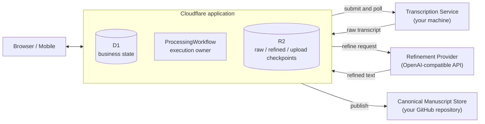

# Read Podcast

[English](README.md) · **简体中文**

> [!NOTE]
> **Cloudflare Free 为目标，生产边界待实测**：维护者的 Cloudflare 部署使用 Workers、D1、Workflows、R2 的 Free 计划，但大 RSS、长节目、GitHub 发布和多任务恢复仍需完成 [#30](https://github.com/xielevi/read-podcast/issues/30) 的生产验证。转录与精修可能产生额外服务商费用。也可以在单机上用 Docker / Node、SQLite、本地对象存储和本地稿件目录运行同一套代码，无需 Cloudflare 账号。
>
> **与 v0.x（Python / macOS App）的关系**：Read Podcast 最初是使用 Python、MLX Whisper 并以 DMG 分发的 macOS 原生桌面应用。桌面版开发目前暂停，v0.x 源码归档于 [`legacy/python`](https://github.com/xielevi/read-podcast/tree/legacy/python)。从 v1.0 开始，同一套 TypeScript 代码支持 Cloudflare 与单机 Docker / Node 两种部署，提供响应式浏览器界面。

**一个可部署在 Cloudflare 或 Docker 的个人播客阅读系统。** 挑出值得留下的单集，Read Podcast 会把每一集整理成一份完整、可读的长文稿——
不是摘要。你可以在任何设备上阅读它、以公开页面分享它，并以 Markdown 形式保存在你自己拥有的稿件存储里。

<p align="center">
  
</p>

## 为什么

播客是听人把思考过程说出来的最好地方之一，也是最难留住这些内容的地方之一。音频是线性的：
不能扫读、不能检索、不能引用，三周之后你也找不回真正重要的那十分钟。常见的解法是 AI 摘要——
它回答的是“值不值得听”，却把论证本身压缩掉了：追问、案例、犹豫。

Read Podcast 走相反的路。它的产出是一份**稿件**：完整的对话，标注说话人、去掉口语噪音、按话题加上
小标题——长度与原始转录大致相当。你用阅读代替重听，而稿件始终归你所有。

## 怎么用

**订阅 → 生成 → 阅读 → 分享。** 工作区分为三块——*订阅*、*导入*、*稿件*——外加阅读器。

1. **订阅或导入。** 通过搜索 Apple Podcasts 目录或粘贴 RSS 地址添加节目。单集列表来自 RSS，
   浏览时自动刷新。也可以导入自己的音频文件（最大 200 MiB）——演讲、课程、访谈都可以。
2. **生成。** 不会自动处理任何内容：由你挑选单集并点击“生成稿件”。进度是真实的，分四个阶段上报——
   获取音频、转写、整理、保存——期间可以关掉浏览器。导入音频时可以选择稿件风格（杂志精修、清洁逐字稿、
   结构化访谈）并补充自己的说明。
3. **阅读。** 专注的阅读器，带大纲目录、排版与主题设置；主人还有阅读进度与已读 / 未读状态。
   **关键概念**在主人首次打开稿件时由模型提名，只有能对上真实中文维基百科词条的才会保留，
   所以每个概念链接都指向真实页面。每份稿件都可以下载为 Markdown。
4. **分享。** 同一个工作区的 `/` 是公开只读面，可以浏览订阅与已发布稿件。变更状态的操作在 `/manage` 和 `/api/control/*`：Cloudflare 部署用 Access 保护，Docker 默认只绑定本机，可按需启用 Basic Auth。

<p align="center">
  
</p>

每份已发布稿件都是一个带 YAML frontmatter（标题、节目、日期、时长、来源链接）的 Markdown 文件，
保存在 **Canonical Manuscript Store**：Cloudflare 部署是你自己的 GitHub 仓库，Docker 部署默认是
宿主机上的本地目录（可直接放进 Obsidian 等工具）。Read Podcast 是它前面的阅读界面：数据库只保存
稿件索引，稿件存储保存每份稿件唯一的持久副本。

> **语言。** Read Podcast 目前面向中文播客：界面、内置整理 Prompt 与概念核验（中文维基百科）
> 都是中文。转写本身会自动识别语言。

## 为什么这样设计

把一集两小时的节目变成稿件，需要几十分钟的转写和一次很长的 LLM 调用。一口气跑完的脚本，
在中途出错之前都能用。Read Podcast 的设计目标是：每个昂贵步骤只做一次。

- **持久化管线，而不是脚本。** Cloudflare 部署用 Workflows 和 R2 检查点；Docker 部署用进程内执行器、SQLite 检查点和本地对象存储。整理失败可复用原始转录，发布失败可复用精修结果，不必重复昂贵步骤。
- **自带算力。** 转写运行在你选择的机器上——参考实现是一台 Apple Silicon Mac，本机运行 MLX Whisper——
  通过一个小型 HTTP 协议对接。它不持有凭据、没有持久的业务状态，只需要在单集转写期间在线。
  整理使用你配置的任意 OpenAI 兼容 API。
- **编辑，而不是摘要。** 默认整理目标约为原始转录的 75%–85%：主动压缩口语冗余，同时保留独立信息与
  推理过程。独立的完整度保护会拒绝低于运行时硬下限（默认 70%）或缺少基本稿件结构的结果。
  被拒绝的结果绝不会发布；原始转录会保留，可以重试。
- **产出归你所有。** 稿件存放在你控制的稿件存储里——Cloudflare 部署是 GitHub 仓库（纯 Markdown、
  有版本），Docker 部署是本地目录。公开读者读到的是发布时记录的那个版本，并在 Cloudflare 边缘缓存，
  匿名流量不会每次都打到 GitHub。
- **公开阅读、私有控制、没有账号。** 访问控制就是 Cloudflare Access 保护的两个路径前缀。
  应用本身没有用户、密码或会话。

## 架构概览

下图是 Cloudflare 部署。Docker / Node 使用同一套应用代码，以 SQLite 代替 D1、进程内带检查点的执行器代替 Workflows、本地文件代替 R2，并默认使用本地稿件目录。见 [Docker 部署](docs/DEPLOYMENT.md#7-local-docker-deployment)。



Cloudflare 路径由 Cloudflare 管理任务从创建到发布的生命周期；Docker 路径则由本地 Node 进程负责。读者只与应用交互。

**数据存放在哪里（除注明外为 Cloudflare 路径）**

| 内容 | 位置 | 保留时长 |
|---|---|---|
| 订阅、单集列表、任务、已读状态、设置、已发布稿件索引 | Cloudflare D1 | 直到你删除 |
| 上传的音频 | Cloudflare R2 `uploads/` | 1 天 |
| 原始转录 | Cloudflare R2 `raw/` | 7 天 |
| 精修文本检查点 | Cloudflare R2 `refined/` | 7 天 |
| 已发布稿件 | Canonical Manuscript Store：你的 GitHub 仓库（Cloudflare）或本地目录（Docker） | 持久保存，直到你删除 |
| 播客音频 | 不保存——转录服务把它下载到本次任务的工作目录 | 任务结束即删除 |
| 凭据（GitHub、LLM、R2 签名、Access service token） | Cloudflare 上的 Wrangler secrets | — |

转录服务只保留每个任务的工作文件，以及 Cloudflare 取走之前的转录结果（最多一天）；它没有数据库，
也没有凭据。任何 API 都不会返回 secret 值。背后的不变量见 [docs/ARCHITECTURE.md](docs/ARCHITECTURE.md)。

## 运行它需要什么

二选一：

- **Cloudflare**：Cloudflare 账号与接入 DNS 的域名、转录机器或云端提供商、OpenAI 兼容 LLM API key，以及有 fine-grained 写入令牌的 GitHub 稿件仓库。使用 Workers（含静态资源）、D1、R2、Workflows、Cron、Access，按需使用 Tunnel。见 [Cloudflare 部署](docs/DEPLOYMENT.md#2-cloudflare-application)。
- **Docker / Node**：单机 Docker Compose、OpenAI 兼容 LLM API key，以及存放 SQLite、临时对象和稿件的磁盘空间。Compose 包含 Faster-Whisper 转录容器；不需要 Cloudflare 账号、域名或 GitHub 仓库。见 [Docker 部署](docs/DEPLOYMENT.md#7-local-docker-deployment)。

**Cloudflare 费用。** 维护者的生产部署使用 Workers Free，但以下发布边界场景尚待实测。
Free 上限包括：每次调用 10 ms CPU（I/O 等待不计入）、每次调用 50 个外部子请求和 1,000 个
Cloudflare 服务子请求、每天 3,000 个 Workflow step、每账号 5 个 Cron Trigger，以及 Workflow
完成后 3 天的实例状态保留期。本应用使用 1 个 Cron Trigger。几百集的大 RSS 源、2–3 小时长节目、
GitHub 发布及单次 cron 恢复多条任务，仍需在具体部署中检查 `exceededCpu` 和子请求超限错误；
已有生产使用不能证明这些边界均已通过。请以 Cloudflare 当前的
[Workers 限制](https://developers.cloudflare.com/workers/platform/limits/)、
[Workflows 限制](https://developers.cloudflare.com/workflows/reference/limits/)及
[Workflows 定价](https://developers.cloudflare.com/workflows/reference/pricing/)为准。LLM 费用主要由作为输入的转录
加上近等长的输出稿件决定，按你的服务商计费。在自己的机器上转写不产生额外的语音转写 API 费用（不含硬件与电费）。

## 边界与取舍

- **单一主人。** 没有多用户模型：谁通过了 Cloudflare Access，谁就控制这个工作区。
- **阅读默认公开。** 你的订阅列表（只有名称与 feed 域名）和所有已发布稿件都会在 `/` 可见。
  如果希望完全私有，让 Access 保护整个域名，而不只是两个控制路径。
- **发布快照。** 公开页面读取的是发布时记录的版本。如果你在稿件存储（仓库或本地目录）里修改了稿件，
  主人视图会显示修改，但公开读者仍然看到已发布的版本，直到你重新生成这一集。
- **转写期间转写机器必须可达。** 原始转录进入 R2 之后它就可以离线；已经过了转写阶段的任务不受影响。
- **按单集手动生成。** 新单集不会被自动处理。
- **唯一的稿件存储。** 每个部署只有一种稿件存储——Cloudflare 是 GitHub 仓库，Docker 默认本地目录。
  没有网盘导出、OAuth 连接器或对话助手，这是刻意的设计。

## 本地试用

```bash
npm install
cp .dev.vars.example .dev.vars
npm run db:migrate:local
npm run dev                       # http://localhost:8787（公开视图）与 /manage（主人视图）
```

本地没有 Access 保护 `/manage`，D1 与 R2 由本地模拟。要端到端生成一份稿件，还需要一个运行中的
转录服务、一个 Refinement Provider key 和一个 GitHub token，并在 `.dev.vars` 中填写你的稿件仓库。
示例文件已把 `TRANSCRIPTION_SERVICE_URL` 指向本机 `http://127.0.0.1:28100` 的服务，无需 Access token。

参考转录服务（Apple Silicon，本地 MLX Whisper）是零配置的——没有配置文件，没有令牌：

```bash
deploy/macos/install.sh           # 依赖检查、uv sync、安装 127.0.0.1:28100 与 :21567 的 LaunchAgent、本机健康检查

# 开发时也可以直接起两个进程：
cd transcription_service && uv sync --locked
bin/run-service                   # 127.0.0.1:28100
bin/run-mlx                       # 127.0.0.1:21567
```

## 部署

[docs/DEPLOYMENT.md](docs/DEPLOYMENT.md) 逐步说明生产部署：D1 与 R2、部署参数、secrets、
Cloudflare Access、转录服务及其 Tunnel，以及冒烟测试。

## 开发

```bash
npm run check                     # TypeScript + Vitest
npm run check:frontend            # 前端语法 + 打包漂移检查
UV_CACHE_DIR=/tmp/read-podcast-edge-uv-cache uv run --directory transcription_service pytest -q
npx wrangler deploy --dry-run
```

仓库是自足的：运行、构建、测试、部署与升级只依赖本仓库。

## 文档

| 文档 | 内容 |
|---|---|
| [docs/ARCHITECTURE.md](docs/ARCHITECTURE.md) | 组件、不变量、任务生命周期、安全边界 |
| [docs/DEPLOYMENT.md](docs/DEPLOYMENT.md) | 生产部署、冒烟测试与运维 |
| [docs/UPGRADING.md](docs/UPGRADING.md) | 升级路径、数据库迁移与破坏性变更处理 |
| [docs/design.md](docs/design.md) | WebUI 产品语言与视觉系统 |
| [.github/CONTRIBUTING.md](.github/CONTRIBUTING.md) | 本地开发、验收命令与提交规范 |
| [.github/SECURITY.md](.github/SECURITY.md) | 安全漏洞报告与架构安全边界 |
| [CHANGELOG.md](CHANGELOG.md) | 版本发布历史与变更说明 |
| [AGENTS.md](AGENTS.md) | 维护者与 Agent 指南 |

## 许可证

[MIT](LICENSE)
