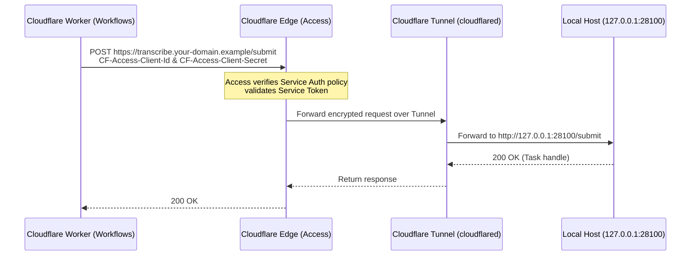

# Deployment

The reference deployment: the Cloudflare application, the Transcription Service on a
macOS host (local MLX Whisper), and a GitHub repository as the Canonical Manuscript Store.
Architecture is described in [ARCHITECTURE.md](ARCHITECTURE.md).

When you are done you will have two hostnames:

| Hostname | Serves | Protected by |
|---|---|---|
| `your-domain.example` | the WebUI: public reading at `/`, the owner workspace at `/manage` | Cloudflare Access on `/manage*` and `/api/control/*` only |
| `transcribe.your-domain.example` | the Transcription Service, through a Cloudflare Tunnel | Cloudflare Access (service token), whole hostname |

`your-domain.example`, `your-github-username`, `your-manuscript-repository` and
`podcasts/transcripts` below are placeholders — use your own values.

## 1. Prerequisites

- A Cloudflare account with your domain on Cloudflare DNS, R2 enabled, and a Zero Trust
  organization (for Access and Tunnel). Workers, D1, Workflows and one Cron Trigger are used.
  Workers Free is supported and used by the maintainer in production; see *Cost* in the
  [README](../README.md#what-you-need-to-run-it) for Free limits and validation boundaries.
- A Transcription Service host (reference: Apple Silicon Mac, macOS 14+, Xcode Command Line
  Tools, `uv`, `cloudflared`).
- A private GitHub repository for manuscripts, and a fine-grained token with
  **Contents: Read and write** on that repository only.
- A Refinement Provider account (any OpenAI-compatible API).
- An R2 API token limited to reading the bucket, used only to sign presigned upload URLs.

## 2. Cloudflare application

### Setup script

`npm run setup` automates most of this section interactively. Every step is idempotent — existing
resources are detected and skipped, so it is safe to rerun at any time and after a failed run. It
checks `wrangler` authentication, creates the D1 database (by the `wrangler.jsonc` `database_name`)
and applies remote migrations, creates the R2 bucket with the three lifecycle rules and verifies
them, prompts for every secret (input hidden, never written to any file), generates `.deploy.env`
with the same validation as `npm run deploy` (documentation placeholders are refused), and prints
the manual checklist below. Steps can also be run individually, for example
`npm run setup -- --step d1`. With `READ_PODCAST_TRANSCRIPTION_PROVIDER=dashscope` already in `.deploy.env`
(see Cloud transcription below) the script keeps it and does not require a transcription URL.

The script cannot do these parts; finish them by hand using the matching sections:

- The Cloudflare Access application for `/manage*` and `/api/control/*` (below).
- The Access service token policy on the transcription hostname (Secrets, below).
- The Cloudflare Tunnel and its connector on the transcription host (section 3).
- The Transcription Service installation (`deploy/macos/install.sh`, section 3).
- Deploying with `npm run deploy` (below) and pointing the Refinement Provider at your API.
- Optional CI deployment variables (Continuous deployment, below).

After deploying, `npm run setup -- --smoke` runs the Access-boundary smoke test (section 4) against
your domain. The subsections below document the same steps without the script.

### Evaluation: Why not a "Deploy to Cloudflare" one-click button?

Community users frequently ask whether Read Podcast could offer a "Deploy to Cloudflare" one-click
button in the repository README. We evaluated Cloudflare's web-based deployment buttons and determined
they cannot fulfill Read Podcast's zero-to-one setup:

1. **Database migrations**: While a deploy button can bind a D1 database name, it cannot run
   `wrangler d1 migrations apply DB --remote` to execute schema migrations (`migrations/0001` through
   `0021`). Without migrations, tables (`articles`, `tasks`, etc.) do not exist and the application
   fails on initial boot.
2. **Storage lifecycle management**: Deploy buttons can create R2 buckets, but cannot configure custom
   object lifecycle rules (`raw-7d`, `refined-7d`, `uploads-1d`). On the Workers Free plan, failing to
   expire temporary audio uploads (1 day) or raw transcripts (7 days) quickly exceeds the 10 GB Free
   storage tier.
3. **Interactive secrets**: The deployment requires credentials for external services (`GITHUB_TOKEN`,
   `REFINER_API_KEY`, R2 presign S3 keys, and Cloudflare Access tokens). Web deploy flows either require
   exposing secrets in source control or leave the Worker in an unconfigured, failing state until manual
   intervention.
4. **Zero Trust separation**: Cloudflare Zero Trust (Access applications, policies, service tokens, and
   Cloudflare Tunnels) is managed in a separate dashboard and control plane (`one.dash.cloudflare.com`)
   that is completely isolated from the Workers Deploy button flow.
5. **Dynamic environment validation**: Read Podcast enforces strict variable validation via
   `scripts/deploy.mjs` to block deployment if documentation placeholders are used.

Therefore, **`npm run setup` is the official, unified deployment setup tool**. It automates every
API-controllable resource idempotently, checks prerequisites, safely sets secrets, and outputs a concise
manual checklist for Zero Trust.

### D1

```bash
npx wrangler d1 create read-podcast-edge      # no need to copy the id into wrangler.jsonc
npm run db:migrate:remote
```

`wrangler.jsonc` deliberately has no `database_id`: Wrangler finds the database by its name,
`read-podcast-edge`, for migrations and for deploys. If Wrangler offers to add the new database to
the config, decline.

Upgrading an existing deployment? See [UPGRADING.md](UPGRADING.md) and run `scripts/preflight_upgrade.sh`
first to list tasks that are still processing.

### R2 and lifecycle rules

```bash
npx wrangler r2 bucket create read-podcast-edge-raw
npx wrangler r2 bucket lifecycle add read-podcast-edge-raw raw-7d raw/ --expire-days 7
npx wrangler r2 bucket lifecycle add read-podcast-edge-raw refined-7d refined/ --expire-days 7
npx wrangler r2 bucket lifecycle add read-podcast-edge-raw uploads-1d uploads/ --expire-days 1 --abort-multipart-days 1
npx wrangler r2 bucket lifecycle list read-podcast-edge-raw
```

The `refined/` rule is required before deploying the refined-checkpoint pipeline, including
when upgrading an existing bucket. Refined payloads remain for 7 days even after success so
publish replay can read them; the application does not delete them on completion.

When upgrading from the durable-stream pipeline, let active workflows finish first. Its
completed `refine` steps contain streams, while the new pipeline expects R2 keys; do not
resume those old checkpoints under the new code. If an old workflow cannot finish, cancel
it where allowed and retry the task after upgrading (a new attempt uses the new format).

### Deployment values

The repository contains no deployment-specific values: `wrangler.jsonc` has no custom domain,
no database id and empty store settings. `npm run deploy` runs `scripts/deploy.mjs`, which reads
your values, refuses to deploy while one is missing or still a documentation placeholder, and
passes them to `wrangler deploy` as `--domain` and `--var`. Put them in a `.deploy.env` file at
the repository root (git-ignored; start from `.deploy.env.example`) or export them as
environment variables, which take precedence:

| Value | Required | Becomes |
|---|---|---|
| `READ_PODCAST_DOMAIN` | yes | the Worker's custom domain, for example `your-domain.example` |
| `READ_PODCAST_TRANSCRIPTION_URL` | yes | `TRANSCRIPTION_SERVICE_URL`, for example `https://transcribe.your-domain.example` |
| `READ_PODCAST_GITHUB_OWNER` | yes | `GITHUB_OWNER` (`your-github-username`) |
| `READ_PODCAST_GITHUB_REPO` | yes | `GITHUB_REPO` (`your-manuscript-repository`) |
| `READ_PODCAST_GITHUB_BRANCH` | no | `GITHUB_BRANCH`, default `main` |
| `READ_PODCAST_GITHUB_PATH` | no | `GITHUB_PODCAST_PATH`, default `podcasts/transcripts` |
| `READ_PODCAST_TRANSCRIPTION_LANGUAGE` | no | `TRANSCRIPTION_LANGUAGE`, for example `zh`, to pin the language instead of auto-detection |
| `READ_PODCAST_TRANSCRIPTION_PROVIDER` | no | `TRANSCRIPTION_PROVIDER`, `self-hosted` (default) or `dashscope` — see [Cloud transcription (DashScope Paraformer)](#cloud-transcription-dashscope-paraformer) |
| `READ_PODCAST_TIME_ZONE` | no | `MANUSCRIPT_TIME_ZONE`, the IANA time zone of `processed_at` in manuscript front matter, default `Asia/Shanghai` |

`node scripts/deploy.mjs --print-args` shows the resulting `wrangler deploy` arguments without
deploying. `npm run setup` writes `.deploy.env` for you (existing values are kept as defaults).
`GITHUB_API_BASE` (GitHub Enterprise) can still be set as a var in `wrangler.jsonc`.

Changing the transcription machine only requires changing `READ_PODCAST_TRANSCRIPTION_URL`,
redeploying and, if the new hostname has its own Access service token, the `CF_ACCESS_*` secrets.

### Secrets

`npm run setup` prompts for each secret below (input hidden, passed to Wrangler over stdin, never
written to a file); press Enter to keep an existing value.

```bash
npx wrangler secret put GITHUB_TOKEN
npx wrangler secret put REFINER_API_KEY
npx wrangler secret put R2_ACCOUNT_ID         # read-only R2 credentials for presigned URLs
npx wrangler secret put R2_ACCESS_KEY_ID
npx wrangler secret put R2_SECRET_ACCESS_KEY
npx wrangler secret put CF_ACCESS_CLIENT_ID   # Access service token for the transcription hostname
npx wrangler secret put CF_ACCESS_CLIENT_SECRET
npx wrangler secret put DASHSCOPE_API_KEY     # only for TRANSCRIPTION_PROVIDER=dashscope
```

Cloudflare is the only side that holds credentials. The reference production path protects the
transcription hostname with Cloudflare Access: create a Service Token (Zero Trust → Access →
Service Tokens) plus a Service Auth policy bound to it, and give Cloudflare only the matching
`CF_ACCESS_CLIENT_ID` / `CF_ACCESS_CLIENT_SECRET`. The host never sees an application credential.

### Cloudflare Access (Authenticated Control Mode)

The application has no login or session management of its own. Access control is delegated to
Cloudflare Access. You will create **one** self-hosted Access application in your Zero Trust dashboard
(`https://one.dash.cloudflare.com/`) that covers exactly the control plane:

```mermaid
flowchart TD
    Req["Incoming Request to your-domain.example"] --> Path{"Requested Path?"}
    Path -->|"/" or "/api/public/*"| Public["Public Browse Mode<br/>(Worker & D1 snapshot, no auth)"]
    Path -->|"/manage*" or "/api/control/*"| AccessCheck{"Cloudflare Access"}
    AccessCheck -->|"Valid identity (Owner)"| Control["Authenticated Control Mode<br/>(Manage subscriptions & jobs)"]
    AccessCheck -->|"Anonymous / unauthorized"| Login["302 Redirect to Access Login<br/>(Email OTP / SSO)"]
```

#### Step-by-step Access setup

1. Navigate to **Zero Trust Dashboard** → **Access** → **Applications**.
2. Click **Add an application**, then select **Self-hosted**.
3. **Step 1: Application Configuration**:
   - **Application name**: `Read Podcast Control` (or any friendly name).
   - **Session Duration**: `24 Hours` (or your preferred session duration).
   - **Application domain**:
     - **Domain**: Select your domain from the dropdown (`your-domain.example`).
     - **Path**: Add two path rules:
       - Rule 1: `manage*`
       - Rule 2: `api/control/*`

   ```text
   ┌────────────────────────────────────────────────────────────────────────┐
   │ Cloudflare Zero Trust → Add Application → Self-hosted                  │
   ├────────────────────────────────────────────────────────────────────────┤
   │ Application name:  [ Read Podcast Control                            ] │
   │ Session Duration:  [ 24 Hours                                      ▼ ] │
   │                                                                        │
   │ Application domain:                                                    │
   │   Domain:          [ your-domain.example                           ▼ ] │
   │   Path (Rule 1):   [ manage*                                         ] │
   │   Path (Rule 2):   [ api/control/*                                   ] │
   └────────────────────────────────────────────────────────────────────────┘
   ```

4. **Step 2: Policies**:
   - Click **Add a policy** (or configure the default policy):
     - **Policy name**: `Allow Owner`
     - **Action**: `Allow`
     - **Session duration**: Same as application
     - **Configure rules** (Include):
       - **Selector**: `Emails`
       - **Value**: `your-email@example.com` (the email where Cloudflare will send one-time login pins)

   ```text
   ┌────────────────────────────────────────────────────────────────────────┐
   │ Policy: Allow Owner                                                    │
   ├────────────────────────────────────────────────────────────────────────┤
   │ Policy name:       [ Allow Owner                                     ] │
   │ Action:            [ Allow                                         ▼ ] │
   │                                                                        │
   │ Rules (Include):                                                       │
   │   Selector: [ Emails          ▼ ]  Value: [ your-email@example.com   ] │
   └────────────────────────────────────────────────────────────────────────┘
   ```

5. Click **Next** through additional settings (CORS and cookie settings keep default values) and click **Save application**.

| Public hostname path | Purpose |
|---|---|
| `your-domain.example/manage*` | workspace pages in Authenticated Control Mode |
| `your-domain.example/api/control/*` | every control-plane API |

> [!CAUTION]
> **Do NOT cover `/` or `/api/public/*`**:
> Those paths serve the read-only Public Browse Mode. If you configure Access to guard the entire
> root (`/` or wildcard `*`), public visitors will be blocked from browsing published manuscripts.
> An existing Access application that protects the whole hostname keeps working but hides Public
> Browse Mode; narrow it to the two paths above to open browsing to the public. Every control in
> Public Browse Mode that would change state navigates to `/manage`, so Access prompts for login
> exactly when it is needed.
>
> Keep `workers_dev: false` and `preview_urls: false` in `wrangler.jsonc` so the Worker is not
> reachable on a hostname Access does not guard.

### Deploy

```bash
npm run check && npm run check:frontend
npm run deploy -- --dry-run   # validate deployment values and bundle, without going live
npm run deploy                # Worker, custom domain, ProcessingWorkflow (read-podcast-processing), recovery cron
```

Then open `https://your-domain.example/manage`, sign in through Access, and in Settings point
the Refinement Provider (service address and model) at your own OpenAI-compatible API **before
your first generation**. A new database starts with the built-in default provider, OpenCode Go
(`https://opencode.ai/zen/go/v1`, model `deepseek-v4.1-flash`); if your `REFINER_API_KEY` belongs
to another provider, change these first, or the key is sent to OpenCode. The *Test* button calls
the provider from Cloudflare. The completeness guard hard floor (default `0.7`) is in the same panel; the built-in editorial prompt targets roughly 75–85%.

### Continuous deployment

`.github/workflows/ci.yml` runs the checks on every push and pull request. On a push to `main`
its `deploy-production` job runs the same `npm run deploy` and then the Access-boundary smoke
test below against `READ_PODCAST_DOMAIN`. It reads the deployment values from GitHub Actions
**repository variables** (Settings → Secrets and variables → Actions → Variables) with the names
in the table above, and is skipped entirely while `READ_PODCAST_DOMAIN` is unset, so a fork does
not try to deploy. To enable it:

1. Add the repository variables (at least the four required ones).
2. Create a GitHub environment named `production` with the `CLOUDFLARE_API_TOKEN` and
   `CLOUDFLARE_ACCOUNT_ID` secrets.

## 3. Transcription Service

The service is zero-configuration: no configuration file, no `.env`, no application token.

```bash
git clone <this repository> && cd read-podcast-edge
deploy/macos/install.sh
```

`install.sh` checks macOS / Apple Silicon / `uv`, runs `uv sync --locked`, verifies that
`mlx_whisper` imports, installs two LaunchAgents (`com.readpodcast.transcription` on
`127.0.0.1:28100` and `com.readpodcast.mlx` on `127.0.0.1:21567`) and runs a local health check.
Runtime state lives in `~/Library/Application Support/ReadPodcastEdge`, logs in
`~/Library/Logs/ReadPodcastEdge`; nothing else is written, and no credential is stored.

While developing, the two processes can be started directly instead:

```bash
cd transcription_service && uv sync --locked
bin/run-service                   # 127.0.0.1:28100
bin/run-mlx                       # 127.0.0.1:21567
```

### Cloudflare Tunnel and Service Token (Transcription Host Protection)

The reference deployment uses a **remotely-managed** Cloudflare Tunnel combined with an Access
**Service Token**:



The host requires zero port-forwarding and holds no Cloudflare credentials; `cloudflared` securely
maintains an outbound-only connection to Cloudflare's edge.

#### Step 1: Create an Access Service Token

1. Navigate to **Zero Trust Dashboard** (`https://one.dash.cloudflare.com/`) → **Access** → **Service Tokens**.
2. Click **Create Service Token**.
3. Set **Service Token Name**: `read-podcast-transcription`.
4. Set **Service Token Duration**: `Non-expiring` (recommended).
5. Click **Save**:
   - **CRITICAL**: Copy both **Client ID** and **Client Secret** immediately. Cloudflare will **never** display the Client Secret again.
   - Enter them when prompted by `npm run setup -- --step secrets` (or save as `CF_ACCESS_CLIENT_ID` and `CF_ACCESS_CLIENT_SECRET` via `npx wrangler secret put`).

#### Step 2: Create the Access Application for the Transcription Hostname

1. Navigate to **Access** → **Applications** → **Add an application** → **Self-hosted**.
2. **Application Configuration**:
   - **Application name**: `Read Podcast Transcription Service`.
   - **Application domain**:
     - **Subdomain**: `transcribe` (matches `READ_PODCAST_TRANSCRIPTION_URL`).
     - **Domain**: `your-domain.example`.
     - **Path**: Leave blank (protects all endpoints on the transcription hostname).
3. **Policy Configuration**:
   - **Policy name**: `Service Auth Policy`.
   - **Action**: Select **Service Auth** from the dropdown (⚠️ **NOT** `Allow`!).
   - **Configure rules** (Include):
     - **Selector**: `Service Token`.
     - **Value**: Select `read-podcast-transcription`.

   ```text
   ┌────────────────────────────────────────────────────────────────────────┐
   │ Cloudflare Access: Transcription Host Protection                       │
   ├────────────────────────────────────────────────────────────────────────┤
   │ Application name:    [ Read Podcast Transcription Service            ] │
   │ Domain:              [ transcribe ].[ your-domain.example            ] │
   │ Path:                [ (empty)                                       ] │
   │                                                                        │
   │ Policy:                                                                │
   │   Policy name:       [ Service Auth Policy                           ] │
   │   Action:            [ Service Auth                                ▼ ] │
   │   Include rule:      [ Service Token  ▼ ] = [ read-podcast-transc...▼] │
   └────────────────────────────────────────────────────────────────────────┘
   ```

4. Click **Next** through additional settings and click **Save application**.

#### Step 3: Create and Connect the Cloudflare Tunnel

1. Navigate to **Networks** → **Tunnels**.
2. Click **Add a tunnel** (or **Create a tunnel**), select **Cloudflare** as the tunnel type, and click **Next**.
3. **Name your tunnel**: e.g., `read-podcast-transcription`, then click **Save tunnel**.
4. **Install and run a connector**:
   - Select your host OS (e.g. **macOS** or **Linux**).
   - Cloudflare will provide an installation command containing your tunnel token.
   - Run the command on your transcription machine:
     ```bash
     # macOS example:
     brew install cloudflared
     sudo cloudflared service install <your-tunnel-token>
     ```
   - Once running, the dashboard shows connector status as **HEALTHY** (Active). Click **Next**.
5. **Route public hostname**:
   - **Subdomain**: `transcribe`
   - **Domain**: `your-domain.example`
   - **Path**: Leave blank
   - **Service**:
     - **Type**: `HTTP`
     - **URL**: `127.0.0.1:28100` (or `localhost:28100`)

   ```text
   ┌────────────────────────────────────────────────────────────────────────┐
   │ Cloudflare Tunnel: Public Hostname Configuration                       │
   ├────────────────────────────────────────────────────────────────────────┤
   │ Public hostname:                                                       │
   │   Subdomain:         [ transcribe                                    ] │
   │   Domain:            [ your-domain.example                         ▼ ] │
   │   Path:              [ (empty)                                       ] │
   │                                                                        │
   │ Service:                                                               │
   │   Type:              [ HTTP                                        ▼ ] │
   │   URL:               [ 127.0.0.1:28100                               ] │
   └────────────────────────────────────────────────────────────────────────┘
   ```

6. Click **Save hostname**.

#### Step 4: Verify Host Connectivity

On your local machine or from any terminal, test the complete path (Access Service Auth → Tunnel → local service) using curl:

```bash
curl -fsS -H "CF-Access-Client-Id: your-client-id" \
          -H "CF-Access-Client-Secret: your-client-secret" \
          https://transcribe.your-domain.example/health
```

A healthy service returns `{"status":"ok"}`. The deployed Worker uses these same headers to communicate with the service during transcription jobs.

### OpenAI-compatible upload proxy engine (`openai-proxy`)

When you do not want to run local Whisper models (e.g. in resource-constrained environments
like NAS or small VPS), you can set the Transcription Service to proxy any OpenAI-compatible
`/audio/transcriptions` API. The service uses `ffmpeg` to transcode audio to low-bitrate mono,
splits files exceeding the upstream upload limit (e.g. 25MB) at silence points with a short
overlap, calls the upstream per chunk with retries, and deduplicates the merged transcript text.

The service's external HTTP contract (`/v1/transcriptions`) is identical, so the Worker or
caller does not need to know the engine is proxying.

Set the following environment variables on the transcription host or container:

```bash
READ_PODCAST_TRANSCRIPTION_ENGINE=openai-proxy
```

#### Example 1: OpenAI

```bash
export READ_PODCAST_TRANSCRIPTION_ENGINE=openai-proxy
export READ_PODCAST_OPENAI_API_KEY="sk-..."
export READ_PODCAST_OPENAI_MODEL="whisper-1"
# Optional: READ_PODCAST_OPENAI_API_BASE defaults to https://api.openai.com/v1
```

#### Example 2: Groq

```bash
export READ_PODCAST_TRANSCRIPTION_ENGINE=openai-proxy
export READ_PODCAST_OPENAI_API_BASE="https://api.groq.com/openai/v1"
export READ_PODCAST_OPENAI_API_KEY="gsk_..."
export READ_PODCAST_OPENAI_MODEL="whisper-large-v3"
```

#### Example 3: SiliconFlow

```bash
export READ_PODCAST_TRANSCRIPTION_ENGINE=openai-proxy
export READ_PODCAST_OPENAI_API_BASE="https://api.siliconflow.cn/v1"
export READ_PODCAST_OPENAI_API_KEY="sk-..."
export READ_PODCAST_OPENAI_MODEL="FunAudioLLM/SenseVoiceSmall"
```

Optional tuning variables:
- `READ_PODCAST_OPENAI_CHUNK_SIZE_MB`: upload chunk limit in MiB (default: `24`, 1 MiB under the standard 25 MiB ceiling).
- `READ_PODCAST_OPENAI_OVERLAP_SECONDS`: overlap between consecutive chunks for silence split boundary (default: `2.0`).
- `READ_PODCAST_OPENAI_TIMEOUT_SECONDS`: upload request timeout in seconds (default: `180`).
- `READ_PODCAST_OPENAI_MAX_RETRIES`: max retry attempts per chunk on rate-limits (429) or transient 5xx errors (default: `3`).

## 4. Cloud transcription (DashScope Paraformer)

Instead of running the Transcription Service on your own hardware, transcription can be
delegated to Alibaba Cloud Model Studio (百炼) Paraformer recorded-speech recognition. The
default stays `self-hosted`: a deployment that does not set
`READ_PODCAST_TRANSCRIPTION_PROVIDER` behaves exactly as before.

To switch this deployment to the cloud provider:

```bash
# in .deploy.env (or as environment variables):
READ_PODCAST_TRANSCRIPTION_PROVIDER=dashscope
# READ_PODCAST_TRANSCRIPTION_URL becomes optional in this mode (no transcription host exists)
npx wrangler secret put DASHSCOPE_API_KEY      # from the Alibaba Cloud Model Studio console
npm run deploy
```

What changes and what does not:

- The Workflow, task lifecycle, raw/refined R2 checkpoints and publishing are identical for
  both providers; only the transcription client differs (see *Cloud transcription adapter*
  in [ARCHITECTURE.md](ARCHITECTURE.md)). Submission replay reuses the provider handle
  recorded in D1; a submission whose response was lost mid-flight can still create a second
  provider task (the provider has no idempotency key) — results expire after 24 hours and
  no business state is affected.
- **Privacy: audio leaves your deployment.** The Worker sends the audio URL to Alibaba
  Cloud, which fetches and processes the audio. RSS audio is handed over as its final,
  redirect-resolved public URL; uploaded audio is handed over as a presigned R2 GET URL that
  is read-only, bound to that single object and expires after 2 hours. If this is
  unacceptable for a feed, remove the subscription or switch back to `self-hosted`
  (unset `READ_PODCAST_TRANSCRIPTION_PROVIDER` and redeploy).
- **It is a paid provider.** Every processed task consumes quota according to the provider's
  pricing (per audio duration); the Settings probe for `dashscope` only verifies that the
  API key is configured and never calls the provider. The provider choice has not been
  benchmark-verified yet (evaluation issue pending): if episodes fail with
  `provider_audio_fetch_failed` — the provider could not fetch hotlink-protected audio —
  or the accuracy does not hold up, switch back to the self-hosted service.

## 5. Smoke test

```bash
curl -fsS http://127.0.0.1:28100/health        # on the transcription host
curl -fsS http://127.0.0.1:21567/health        # the MLX engine

# from Cloudflare (Access service token): proves Access + Tunnel + service in one request
curl -fsS -H "CF-Access-Client-Id: $CF_ACCESS_CLIENT_ID" \
          -H "CF-Access-Client-Secret: $CF_ACCESS_CLIENT_SECRET" \
          https://transcribe.your-domain.example/health
```

The control API has a transcription probe that verifies the same path (Access credential, Tunnel
and service) from the deployed Worker and never returns a secret value. Run it from the browser
console of a signed-in `/manage` tab:

```js
fetch('/api/control/settings/test', { method: 'POST', headers: { 'content-type': 'application/json' },
  body: JSON.stringify({ target: 'transcription' }) }).then(r => r.json()).then(console.log)
```

1. Access boundary, anonymous (no Access cookie) — `npm run setup -- --smoke` runs the same four
   checks from your machine:

   ```bash
   curl -sS -o /dev/null -w '%{http_code}\n' https://your-domain.example/                    # 200
   curl -sS -o /dev/null -w '%{http_code}\n' https://your-domain.example/api/public/articles  # 200
   curl -sS -o /dev/null -w '%{http_code} %{redirect_url}\n' https://your-domain.example/manage              # 302 → cloudflareaccess.com
   curl -sS -o /dev/null -w '%{http_code} %{redirect_url}\n' https://your-domain.example/api/control/tasks   # 302 → cloudflareaccess.com
   ```

   The `deploy-production` CI job runs the same check after every deploy and fails if the
   control plane answers an anonymous request (see [Continuous deployment](#continuous-deployment)).
2. Open `https://your-domain.example/manage`, sign in through Access, subscribe to a podcast
   and process an episode. Progress increases monotonically through fetching audio, transcribing, refining and saving.
3. Confirm `raw/<task>/<attempt>.txt` appears in R2 and a `<YYYYMMDD_podcast_episode>.md`
   manuscript appears under `podcasts/transcripts/` in your manuscript repository.
4. Upload a local `.mp3` / `.m4a` (under 200 MiB) and confirm it completes.
5. Open the article in the Library and confirm concepts load; open it again from the public
   `https://your-domain.example/` in a private window.
6. Resilience: stop the Transcription Service after the raw transcript reaches R2 — the task
   must still complete; retry a task whose refinement failed with the service offline — it must
   re-refine without transcribing.

## 6. Operations

Scripts in `deploy/macos/`:

| Action | Command |
|---|---|
| Status | `./status.sh` |
| Logs | `./logs.sh transcription` · `./logs.sh mlx` · `./logs.sh transcription-err` · `./logs.sh mlx-err` |
| Restart | `./restart.sh` |
| Upgrade | `./update.sh` (pull, sync dependencies, test, restart) |
| Uninstall | `./uninstall.sh` |

To rotate a credential, set the new value, verify with the smoke test, then remove the old one.

## Resource names and Free-plan boundary checks

The package and existing Worker, D1, R2 and Workflow resource names remain unchanged for
the public repository import. They are implementation identifiers, not personal deployment
values. Renaming cloud resources is a separate migration; changing a name can create a new
resource instead of reusing the production data.

### Workers Free Plan Quotas and Operational Boundaries

The entire Cloudflare stack operates within the **Workers Free tier ($0/month)**. Free tier
quotas relevant to Read Podcast:

| Resource | Free Tier Quota | Application Usage Pattern |
|---|---|---|
| **Worker CPU Time** | 10 ms per invocation | Lightweight routing & API parsing (I/O wait excluded) |
| **External Subrequests** | 50 per invocation | Fetching RSS, calling GitHub API, polling transcription |
| **Cloudflare Subrequests** | 1,000 per invocation | D1 database queries and R2 object operations |
| **Workflow Step Quotas** | 3,000 steps / day | Multi-step execution per episode (`download` → `transcribe` → `refine` → `save`) |
| **Cron Triggers** | 5 triggers / account | Exactly 1 trigger used (5-minute background recovery) |
| **R2 Storage** | 10 GB storage free | Managed by 1-day (`uploads/`) and 7-day (`raw/`, `refined/`) lifecycle rules |

### Production Boundary Verification Checklist

Local tests and `wrangler deploy --dry-run` validate code logic and syntax, but cannot measure
production edge CPU or enforce the Free-plan subrequest budget. Maintainers and community users
should monitor the following four operational scenarios against Workers Observability logs:

1. **Large RSS Feeds (Several Hundred Episodes)**:
   - *Boundary*: Parsing very large XML feeds with 200–500+ items within the 10 ms CPU budget.
   - *Design guard*: The feed parser uses streaming XML parsing and server-side pagination, fetching episodes on demand rather than buffering the entire catalog in Worker memory.
   - *Verification*: Subscribe to an extensive feed (e.g. 500+ episodes), open its episode list, and inspect CPU execution duration in Workers Logs.
2. **Long Podcast Episodes (2–3 Hours)**:
   - *Boundary*: Audio download and transcription polling across extended audio files; chunked LLM refinement.
   - *Design guard*: Polling is non-blocking (sleep/retry intervals managed across Workflow steps). Heavy speech-to-text processing occurs outside the Worker (on your host or via provider).
   - *Verification*: Process an episode longer than 2 hours. Confirm the workflow completes without `exceededCpu` or step timeouts.
3. **GitHub Manuscript Publication**:
   - *Boundary*: Writing markdown files and front matter via the GitHub REST API without exhausting subrequests or payload size limits.
   - *Design guard*: R2 holds the finalized refined checkpoint so publication retries replay without re-generating text.
   - *Verification*: Inspect the publish step log; verify that the commit appears under `podcasts/transcripts/` in your repository.
4. **Multi-Task Cron Recovery**:
   - *Boundary*: A scheduled cron trigger firing when multiple queued tasks or dead workflows need reconciliation simultaneously.
   - *Design guard*: Cron recovery processes stalled tasks in batches to avoid exceeding subrequest budgets.
   - *Verification*: Queue several episodes while the transcription service is temporarily paused, restart the service, and verify the cron smoothly reconciles pending tasks.

### Monitoring Logs and Investigating Errors

To stream live logs during generation or boundary tests:

```bash
# Live tail of the deployed Worker
npx wrangler tail --format pretty
```

Alternatively, open **Cloudflare Dashboard** → **Workers & Pages** → **read-podcast-edge** → **Observability** → **Logs**:
- Filter by status `Error` or search for `exceededCpu`.
- Check the **Metrics** tab for p50, p90, and p99 CPU duration distributions.
- If an edge case triggers `exceededCpu` or a subrequest limit error, report the episode audio length, feed item count, and log trace in the project repository issues.
